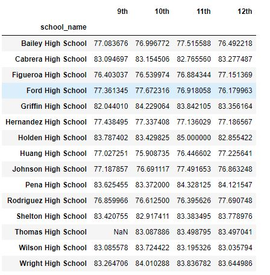
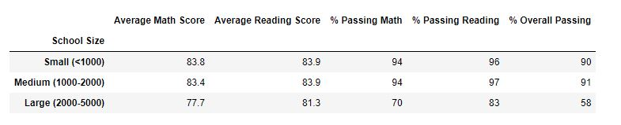

# School_District_Analysis
## Overview
We were asked to analyze how the values of some key performance metrics changed when the 9th graders of Thomas High School had their data ommitted from the original analysis due to suspected academic dishonesty.

## Purpose and Resources
This analysis used the Pandas library in Jupyter Notebook to calculate the values used in the necessary performance metrics as well as to replace all reading and math scores from 9th graders at Thomas High School with a NaN value. Those categories were:

1) Total number of schools; 2) total number of students; 3) the total budget of all schools; 4) the average math score; 5) the average reading score; 6) the percentage of students passing math; 7) the percentage of students passing reading, and 8) the overall passing percentage. 

This analysis required us to compare these metrics with and without the data for Thomas High School 9th graders and note their changes, if any.

## Results

Below are displayed the overall results taken from the entire student population:

And here are the overall results with Thomas High School 9th graders removed:

#### We can discuss in more detail how each metric was affected by the change in data.

  - For the District Summary, Total Schools, Total Students and Total Budget are unaffected because we chose not to delete the values from Thomas High School 9th graders and instead replace them with NaN. If the entire row for a Thomas High School 9th graders were deleted instead of replacing just their math and reading scores with a NaN value, those three Totals **would** have been affected because we would be deleting those students completely from the list. 

      > Average Math Score and Average Reading Score are slightly affected by removing those values, changing from 78.9 and 81.87 respectively to 78.9 and 81.9 respectively.

      > Passing percentages overall and for reading changed somewhat, from 65.1% and 74.9% respectively to 64.9% and 74.8% respectively. The percent passing math did not change.

##### Analysis of just Thomas High School before and after cleaning:

  > - The Average Math Score dropped from 83.42% to 83.35%.
  - The Average Reading Score rose from 83.85% to 83.90%.
  - The Percent Passing Math dropped from 93.27% to 93.19%.
  - The Percent Passing Reading dropped from 97.31% to 97.02%.
  - The Percent Overall Passing dropped from 90.95% to 90.63%.
 
 ##### Top Schools
 
 
 
 - Thomas High School remained in second place of the top performing schools in the district.
 - The Average Math Score, Average Reading Score, Percent Passing Math, Percent Passing Reading, and Percent Passing Overall
slightly dropped between the original analysis and the cleaned analysis.

##### Math Scores by Grade

 - - The math scores did not change in the 10th-12th grade columns, however in the 9th grade column the scores 
have replaced by "NaN".

##### Reading Scores by Grade

- The reading scores did not change in the 10th-12th grade columns, however in the 9th grade column the scores 
have been replaced by "NaN" like the math scores.

##### Scores by School Spending

 - There was no difference in the original versus cleaned analysis.

##### Scores by School Size

- There was no difference in the original versus cleaned analysis.

##### Scores by School Type

- There was no difference in the original versus cleaned analysis. 

## Summary

1. There was a slight drop in "Average Math Score", "Percent Passing Math", "Percent Passing Reading" and "Overall Passing Percentage" in the District Summary but the rest of the metrics remained the same.
2. The School Summary Analysis had a drop in Average Math Score, Percent Passing Math, Percent Passing Reading and Overall Passing Percentage while the reading score had a slight increase.
3. Thomas High School's rank among the top 5 performing schools was unaffected, but its Average Math, Average Reading, Percent Passing Math, Percent Passing Reading and Overall Passing Percentage all slightly decreased.
4. Rather than deleting rows from the District analysis, now that analysis contains values of NaN in every cell that should contain a math or reading score from a 9th grader at Thomas High School.  

